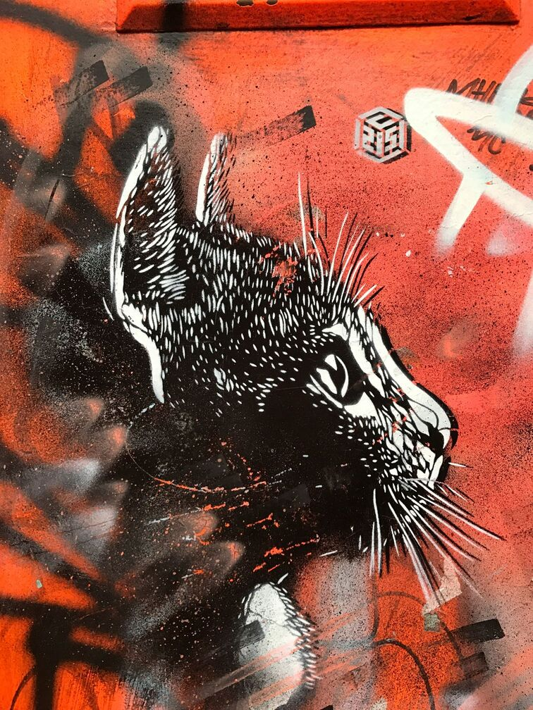

<!doctype html>
<html lang ="fr">

<header>
    <nav>
        <ul>
          <li><a href="Contacts">Contacts</a></li>  
          <li><a href="Informations">Informations</a></li>
        </ul>
    </nav>
    <nav>
        <ul>
            <li><a href="Présentations">Présentation</a></li>
            <li><a href="Artistes">Artistes</a></li>
            <li><a href="Oeuvres">Oeuvres</a></li>
        </ul>
    </nav>
</header>

<body>
    <h1>Galerie Lamuse</h1>
        

    <section class="presentation">
    <h2>Présentation</h2>
    

        
        Gilles François a fondé la galerie Lamuse en 1975. Né dans une 
        famille d’artistes, il a très tôt développé un goût pour la matière, 
        la lumière et la forme. Après des études aux Beaux-Arts, et à l’occasion 
        de nombreux voyages, il aiguise sa vision artistique et sa créativité. Il 
        décide de créer un espace qui lui ressemble : un lieu de découverte, 
        d’échanges et de rencontres ou la créativité se vit au présent. 
        Toujours en quête d’innovation, il collabore avec des artistes aux 
        créations variées, mélant photographie, peinture, et arts numérique. 

   
     
La galerie Laamuse célèbre aujourd’hui l’audace de la femme. Elle offre 
        une scène vibrante aux artistes émergentes et confirmées, dans un mélange 
        de créativité, d’émotions et de réflexions.

     </section>
    
    <section class="artistes">
    <h2>Nos artistes</h2>

    

    

             
             
Eva Lautier

    

    

             
             
Anne-Sophie Paris

    

    

             
             
Jeanne Fostner

    

    

             
             
Josiane Lucas

    

    

             
             
France Chevalier

    

    

             
             
Marie Rose

    

   
    

    </section> 

    <section class="oeuvres">
        <h2>Oeuvres</h2>
        

            
            
            
            
            
            
            
        

    </section>

    <section class="informations">
        <h2>Nous contacter</h2>
        
06 76 54 30 00

        
lamuse.galeriedart@gmail.com

        <h2>Où nous trouver ?</h2>
        
51 rue des fleurs, Nice, 06000

        
9h - 12h et 14h - 17h

    </section>

    

    <section class="news-letter">
        <h2>Abonnez-vous gratuitement à notre News-Letter</h2>
        <label for="pénom">Prénom:</label> 
        <input type="text" id="Prénom" name="Prénom"> 
        <label for="nom">Nom:</label> 
        <input type="text" id="Nom" name="Nom"> 
        <label for="email">E-mail:</label> 
        <input type="text" id="e-mail" name="E-mail"> 
        <button type="button">Soumettre</button>
    </section>
</body>

</head>

<body>

    <!-- ----------- Index ----------- -->
    <nav>
        <a href="#contacts">Contacts</a>
        <a href="#informations">Informations</a>
        <a href="#presentation">Présentation</a>
        <a href="#artistes">Artistes</a>
        <a href="#oeuvres">Oeuvres</a>
    </nav>

    <!-- ----------- Titre ----------- -->
    <h1>Lamuse Galerie</h1>

    <!-- ----------- Main Image ----------- -->
    

        
    

    <!-- ----------- Presentation ----------- -->
    <!-- Assurez que chacune de vos sections sont encadre par cette ligne en bas -->

    <section id="presentation" class="presentation">
        <h2>Présentation</h2>

        

            
            <!-- Remplacez FONDATEUR.jpg par l’image du fondateur -->

            

                Gilles François a fondé la galerie Lamuse en 1975. Né dans une famille d’artistes, 
                il a très tôt développé un goût pour la matière, la lumière et la forme. Après des 
                études aux Beaux-Arts, et à l’occasion de nombreux voyages, il aiguise sa vision 
                artistique et sa créativité. Il décide de créer un espace qui lui ressemble : un lieu 
                de découverte, d’échanges et de rencontres où la créativité se vit au présent. Toujours 
                en quête d’innovation, il collabore avec des artistes aux créations variées, mêlant 
                photographie, peinture, et arts numérique.   
                La galerie Laamuse célèbre aujourd’hui l’audace de la femme. Elle offre une scène 
                vibrante aux artistes émergentes et confirmées, dans un mélange de créativité, 
                d’émotions et de réflexions.
            

        

    </section>
    <section class="news-letter">
    

        
        

            <h2>Abonnez-vous gratuitement à notre News Letter</h2>
            <form id="newsletterForm" onsubmit="return validateForm()">
                

                    

                        <label for="prenom">Prénom :</label>
                        <input type="text" id="prenom" name="prenom" placeholder="Prénom">
                    

                    

                        <label for="nom">Nom :</label>
                        <input type="text" id="nom" name="nom" placeholder="Nom">
                    

                

                <label for="email">Email :</label>
                <input type="email" id="email" name="email" placeholder="Email">

                <button type="submit">Soumettre</button>
            </form>
        

    

</section>

</body>
</html>

